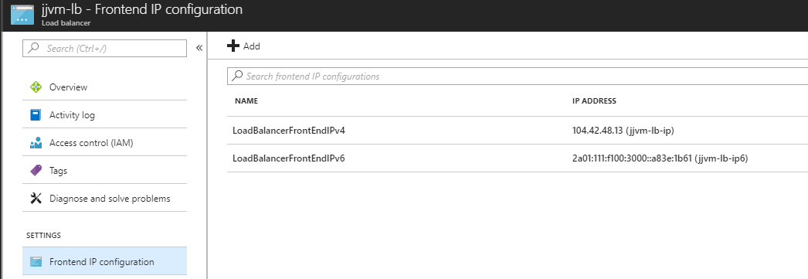

# JJ Azure VM with IPv6 load balancer

This repo contains template with for IPv6 load balancer with virtual machine behind in your virtual network.

Load balancer must have IPv4 address referenced to VM.
There must be separate backend pool referencing IPv6 NICs. You cannot combine NICs wiht IPv4 and IPv6.

[IPv6 overview](https://docs.microsoft.com/en-us/azure/load-balancer/load-balancer-ipv6-overview)

[Sample ARM template](https://docs.microsoft.com/en-us/azure/load-balancer/load-balancer-ipv6-internet-template)

## Deploy template

Update script with your resource group name and select proper OS template.

```bash
rg=<YOUR RESOURCE GROUP>
az group create -n $rg -l westus

az group deployment create -g $rg --template-file deploy-<windows/linux>.json --parameters params.json
```

## Configure server

Load balancer publish port 80, you have install web server

### Linux - install nginx

```bash
sudo apt install nginx
```

Change network adapter to get IPv6 from DHCP and restart server.

```bash
sudo nano /etc/network/interfaces.d/eth0.cfg
# The primary network interface
auto eth0
iface eth0 inet dhcp
iface eth0 inet6 dhcp
```

### Windows - install IIS

TODO JJ: add steps

## Check configuration

You will get public IPv4 and IPv6 addresses.


Load balancer backendpool has assigned IPv4 address only.


VM NIC adapter has assigned IPv4 address only.
