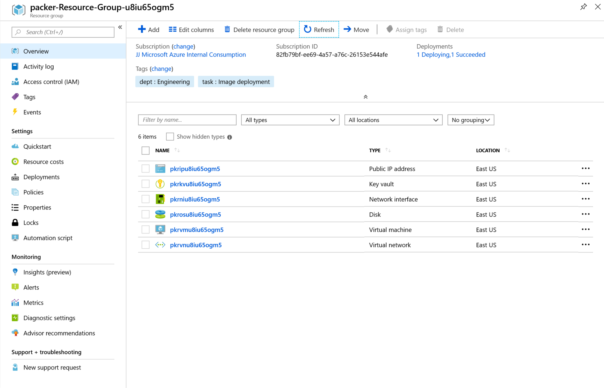

# Deploy a VM Scale Set with managed disks based on custom image

<a href="https://portal.azure.com/#create/Microsoft.Template/uri/https%3A%2F%2Fraw.githubusercontent.com%2Fjjindrich%2Fjjazure-templates%2Fmaster%2Fvmss-customimage-myvnet%2Fazuredeploy.json" target="_blank">
    
</a>
<a href="http://armviz.io/#/?load=https%3A%2F%2Fraw.githubusercontent.com%2Fjjindrich%2Fjjazure-templates%2Fmaster%2Fvmss-customimage-myvnet%2Fazuredeploy.json" target="_blank">
    
</a>

This template allows you to deploy a VM Scale Set with managed disk based on custom image (managed disks functionality). Windows and Linux vhd is supported. To connect from the load balancer to a VM in the scale set, you would go to the Azure Portal, find the load balancer of your scale set, examine the NAT rules, then connect using the NAT rule you want. For example, if there is a NAT rule on port 50000, you could RDP on port 50000 of the public IP to connect to that VM.

VMSS have on data disk size 50 GB.

## How to prepare Image from existing virtual machine
1. Deallocate VM
```azurecli
az vm deallocate --resource-group myResourceGroup --name myVM
```
2. Generalize VM
```azurecli
az vm generalize --resource-group myResourceGroup --name myVM
```
3. Create Image
```azurecli
az image create --resource-group myResourceGroup --name myImage --source myVM
```
OR

click on VM blade and select Capture

<a href="https://docs.microsoft.com/en-us/azure/virtual-machines/linux/capture-image" target="_blank">For more information how to capture image</a>

## How to prepage Image with Packer

Install Packer - https://www.packer.io/downloads.html

Make sure you have Service Principal (jjpacker) with Contributor permissions on subscription level. [Instructions](https://docs.microsoft.com/en-us/azure/virtual-machines/windows/build-image-with-packer#create-azure-credentials)

Temporary resource group is created for packer process (like packer-Resource-Group-u8iu65ogm5)


If you want to use your own resource group and don't use subscription level permissions, use this **build_resource_group_name**

Packer template - 

```powershell
$rgName = "JJImages"
New-AzureRmResourceGroup -Name $rgName -Location WestEurope

packer.exe build .\packer-windows.json
```